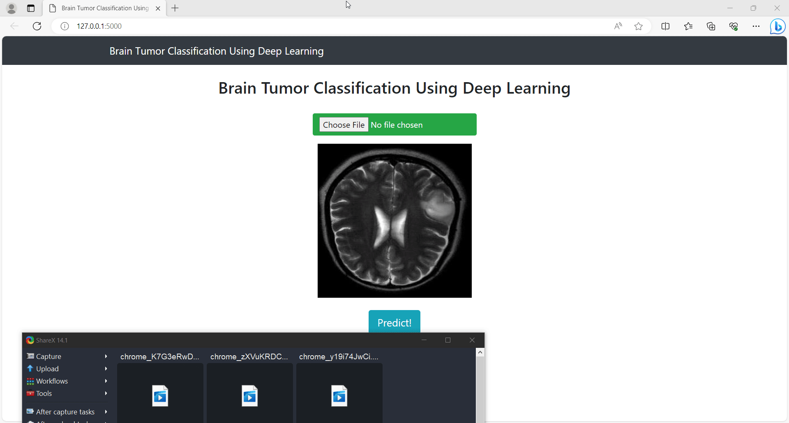

 

## Introduction
Convolutional neural networks (CNN) to detect brain tumors from MRI images. 

There are two pre-trained models in this repo :

1. Binary Cross entropy :  `BrainTumor10Epochs.h5` 
2. Categorical Cross Entropy : `BrainTumorCategorical10Epochs.h5`

Dataset Br35H 👉🏻 https://www.kaggle.com/ahmedhamada0/brain-tumor-detection

To run the webapp locally
1.Clone this repo 
2.Download necessary packages ie(opencv-python, Keras etc)
3.On your Command Prompt enter "python app.py"

27/9
Works with the latest version of the different packages in this tutorial

Next Steps
1.Error Analysis
2.More Advanced Modelling

